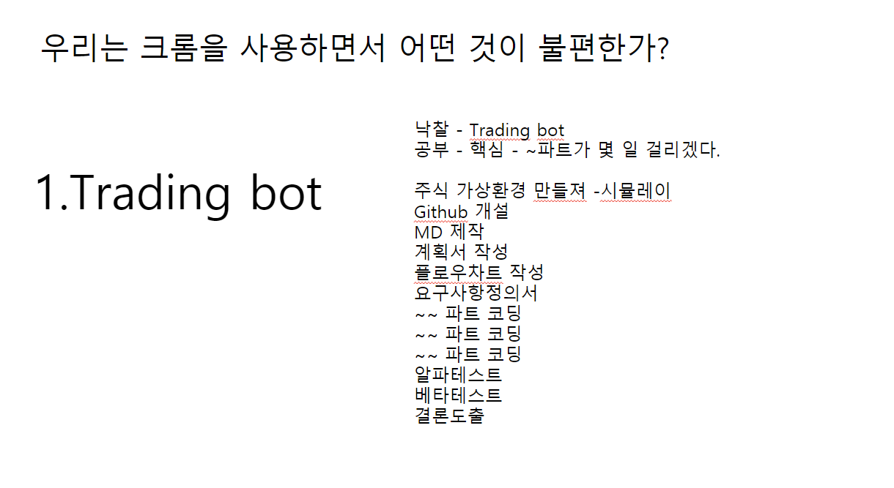
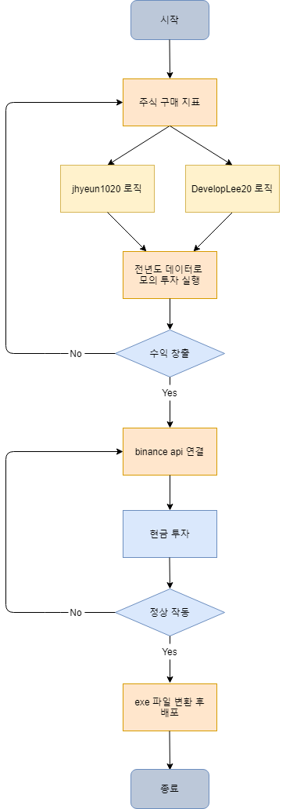

# 1. First day plan (2021/01/19)

# "BTC_USDT.xlsx" 파일 읽는 방법
> * ### date -> 해당 행(OHLCV)의 기준이 되는 시간
> * ### open -> 코인의 시가
> * ### high -> 코인의 고가
> * ### low -> 코인의 저가
> * ### close -> 코인의 종가
> * ### volume -> 코인의 거래량
